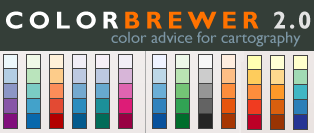

# Tulane Introduction to Python for Data Visualization Workshop Resources
Workshop materials and data visualization resources for the __Introduction to Python for Data Visualization Workshop at Tulane University Howard-Tilton Memorial Library

**Python package dependencies:** `numpy` `pandas` `jupyter` `matplotlib` `seaborn` `plotly`. If you have installed Python through the Anaconda Python distribution then all of these packages will be installed except `plotly`. To install `plotly` run `conda install package-name` in your terminal. 

## Table of Contents

1. [Workshop Review](#review)
1. [Jupyter Notebook Resources](#jupyter)
2. [Gathering and processing data with Python](#data)
3. [Color in Data Visualization](#color)
4. [References](#references)
5. [License](#license)

<a name="review"/>

## Workshop Review

The first half of the workshop, including the introduction to Python, as well as plotting using the `matplotlib` library, is primarily based on the Software Carpentries workshop: [Plotting and Programming in Python](http://swcarpentry.github.io/python-novice-gapminder/). Please review lesson one (Running and Quitting) through lesson nine (Plotting) for a thorough review of the materials covered during the workshop. 

For more background in developing foundational coding and data science skills please refer to other lessons available through the Software Carpentries: https://software-carpentry.org/lessons/

<a href="https://software-carpentry.org/lessons/">
         

<a name="jupyter"/>

## Jupyter Notebook Resources 
The [Jupter Notebook](https://jupyter.org/index.html) is a an open-source, web-based application that can be run locally, or shared online, and allows you to create and share documents (notebooks) that contain live code, visualizations, narrative text, and mathematical equations. They provide a wonderful way of documenting and sharing your research with the world. 

### Sharing your Jupter Notebook. 
These notebooks are rendered natively in Github so you can share them with others. They can be managed under versioning control using Git, and shared on [GitHub](https://github.com/), a cloud-based hosting service that allows you to manage and share your Git repositories. For more information on versioning control and how to create a Git project and share it with the world follow the [Software Carpentries tutorial on Version Control with Git and Github](http://swcarpentry.github.io/git-novice/).
<a name="color"/>

### Jupyter Notebook Shortcuts
To see a list of keyboard shortcuts, in a running Jupyter notebook first enter command mode by hitting `esc`. Then press the `h` key to display the help menu, which will display common operations and their corresponding shortcuts. These shortcuts are operating system dependent, so if you call the `h` prompt from Windows your shortcuts will look different than if you call `h` from a Mac.

### Jupyter Notebook Plugins
Jupyter is extensible, that is you can add plugins to it in order to enhance its functionality. In the 
## Color in Data Visualization

The essential tool for selecting color maps is [ColorBrewer](http://www.colorbrewer2.org)

### Choosing the right colormap for visualization

